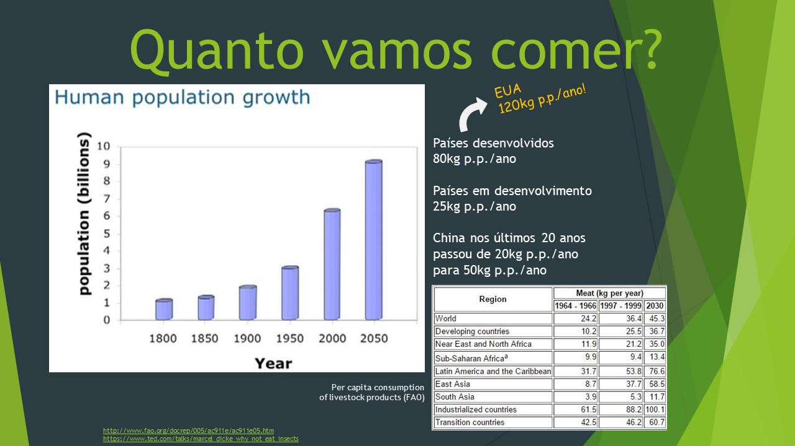

# Uma produção mais verde e barata de proteína animal para consumo em escala

**Greener and cheaper production of animal protein for scale consumption. UFABC 1Q/2015 - Transformations in living beings and environment Class.**

Universidade Federal do ABC - Bacharelado em Ciência e Tecnologia  
Transformações nos seres vivos e ambiente 2015/Q1

## [Abrir a apresentação](./docs/SeminarioTSVA.ppsx)

